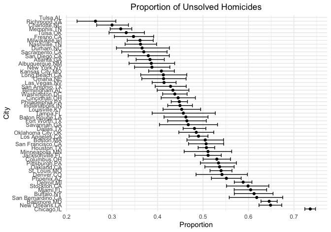
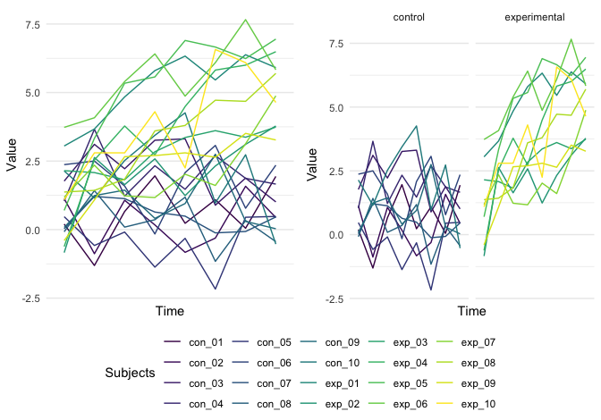

p8105\_hw5\_kb3066
================
Kaila Boyer
11/15/2021

## Problem 1

The raw data includes the column names in the first row and all entries
in the lines below. Entries are separated by commas and they do not
align into neat columns so it is difficult to see what each is
representing. Collected data includes city, date, location coordinates,
disposition, along with victim’s information (name, sex, age, race)

``` r
wash_post <- "https://raw.githubusercontent.com/washingtonpost/data-homicides/master/homicide-data.csv"

post_df <- wash_post %>% url %>% read_csv()

post_df <- post_df %>% mutate(
  city_state = str_c(city, state, sep = ",")
)

post_df <- post_df %>% select(city_state, disposition) %>% 
  mutate(disp = if_else(disposition == "Open/No arrest", "unsolved", 
                if_else(disposition == "Closed without arrest", "unsolved", "solved"))) %>% 
  group_by( disp, city_state) %>% 
  count() %>% 
  pivot_wider( 
    names_from = "disp", 
    values_from = "n") %>% 
  mutate(total = sum(c_across(solved:unsolved), na.rm = T)) 
post_df %>% 
  knitr::kable(caption = "Unsolved cases by state")
```

| city\_state       | solved | unsolved | total |
|:------------------|-------:|---------:|------:|
| Albuquerque,NM    |    232 |      146 |   378 |
| Atlanta,GA        |    600 |      373 |   973 |
| Baltimore,MD      |   1002 |     1825 |  2827 |
| Baton Rouge,LA    |    228 |      196 |   424 |
| Birmingham,AL     |    453 |      347 |   800 |
| Boston,MA         |    304 |      310 |   614 |
| Buffalo,NY        |    202 |      319 |   521 |
| Charlotte,NC      |    481 |      206 |   687 |
| Chicago,IL        |   1462 |     4073 |  5535 |
| Cincinnati,OH     |    385 |      309 |   694 |
| Columbus,OH       |    509 |      575 |  1084 |
| Dallas,TX         |    813 |      754 |  1567 |
| Denver,CO         |    143 |      169 |   312 |
| Detroit,MI        |   1037 |     1482 |  2519 |
| Durham,NC         |    175 |      101 |   276 |
| Fort Worth,TX     |    294 |      255 |   549 |
| Fresno,CA         |    318 |      169 |   487 |
| Houston,TX        |   1449 |     1493 |  2942 |
| Indianapolis,IN   |    728 |      594 |  1322 |
| Jacksonville,FL   |    571 |      597 |  1168 |
| Kansas City,MO    |    704 |      486 |  1190 |
| Las Vegas,NV      |    809 |      572 |  1381 |
| Long Beach,CA     |    222 |      156 |   378 |
| Los Angeles,CA    |   1151 |     1106 |  2257 |
| Louisville,KY     |    315 |      261 |   576 |
| Memphis,TN        |   1031 |      483 |  1514 |
| Miami,FL          |    294 |      450 |   744 |
| Milwaukee,wI      |    712 |      403 |  1115 |
| Minneapolis,MN    |    179 |      187 |   366 |
| Nashville,TN      |    489 |      278 |   767 |
| New Orleans,LA    |    504 |      930 |  1434 |
| New York,NY       |    384 |      243 |   627 |
| Oakland,CA        |    439 |      508 |   947 |
| Oklahoma City,OK  |    346 |      326 |   672 |
| Omaha,NE          |    240 |      169 |   409 |
| Philadelphia,PA   |   1677 |     1360 |  3037 |
| Phoenix,AZ        |    410 |      504 |   914 |
| Pittsburgh,PA     |    294 |      337 |   631 |
| Richmond,VA       |    316 |      113 |   429 |
| Sacramento,CA     |    237 |      139 |   376 |
| San Antonio,TX    |    476 |      357 |   833 |
| San Bernardino,CA |    105 |      170 |   275 |
| San Diego,CA      |    286 |      175 |   461 |
| San Francisco,CA  |    327 |      336 |   663 |
| Savannah,GA       |    131 |      115 |   246 |
| St. Louis,MO      |    772 |      905 |  1677 |
| Stockton,CA       |    178 |      266 |   444 |
| Tampa,FL          |    113 |       95 |   208 |
| Tulsa,AL          |      1 |       NA |     1 |
| Tulsa,OK          |    390 |      193 |   583 |
| Washington,DC     |    756 |      589 |  1345 |

Unsolved cases by state

``` r
baltimore <- post_df %>% filter(city_state == "Baltimore,MD") 

prop.test(baltimore$unsolved, baltimore$total) %>% 
  broom::tidy() %>% 
  select(estimate, conf.low, conf.high) %>% 
  knitr::kable()
```

|  estimate |  conf.low | conf.high |
|----------:|----------:|----------:|
| 0.6455607 | 0.6275625 | 0.6631599 |

``` r
nest_post1 <- post_df %>% nest(city_state)
prop_test = function(var_numerator, var_denominator) {
  
  try(prop.test(var_numerator, var_denominator) %>% 
    broom::tidy() %>% 
    select(estimate, conf.low, conf.high), silent = TRUE)
  
} 
post2 <- nest_post1 %>% 
  mutate(cis = map2(unsolved, total, prop_test)) %>% 
  unnest()  

post2 %>% select(city_state, estimate, conf.low, conf.high) %>% knitr::kable()
```

| city\_state       |  estimate |  conf.low | conf.high |
|:------------------|----------:|----------:|----------:|
| Albuquerque,NM    | 0.3862434 | 0.3372604 | 0.4375766 |
| Atlanta,GA        | 0.3833505 | 0.3528119 | 0.4148219 |
| Baltimore,MD      | 0.6455607 | 0.6275625 | 0.6631599 |
| Baton Rouge,LA    | 0.4622642 | 0.4141987 | 0.5110240 |
| Birmingham,AL     | 0.4337500 | 0.3991889 | 0.4689557 |
| Boston,MA         | 0.5048860 | 0.4646219 | 0.5450881 |
| Buffalo,NY        | 0.6122841 | 0.5687990 | 0.6540879 |
| Charlotte,NC      | 0.2998544 | 0.2660820 | 0.3358999 |
| Chicago,IL        | 0.7358627 | 0.7239959 | 0.7473998 |
| Cincinnati,OH     | 0.4452450 | 0.4079606 | 0.4831439 |
| Columbus,OH       | 0.5304428 | 0.5002167 | 0.5604506 |
| Dallas,TX         | 0.4811742 | 0.4561942 | 0.5062475 |
| Denver,CO         | 0.5416667 | 0.4846098 | 0.5976807 |
| Detroit,MI        | 0.5883287 | 0.5687903 | 0.6075953 |
| Durham,NC         | 0.3659420 | 0.3095874 | 0.4260936 |
| Fort Worth,TX     | 0.4644809 | 0.4222542 | 0.5072119 |
| Fresno,CA         | 0.3470226 | 0.3051013 | 0.3913963 |
| Houston,TX        | 0.5074779 | 0.4892447 | 0.5256914 |
| Indianapolis,IN   | 0.4493192 | 0.4223156 | 0.4766207 |
| Jacksonville,FL   | 0.5111301 | 0.4820460 | 0.5401402 |
| Kansas City,MO    | 0.4084034 | 0.3803996 | 0.4370054 |
| Las Vegas,NV      | 0.4141926 | 0.3881284 | 0.4407395 |
| Long Beach,CA     | 0.4126984 | 0.3629026 | 0.4642973 |
| Los Angeles,CA    | 0.4900310 | 0.4692208 | 0.5108754 |
| Louisville,KY     | 0.4531250 | 0.4120609 | 0.4948235 |
| Memphis,TN        | 0.3190225 | 0.2957047 | 0.3432691 |
| Miami,FL          | 0.6048387 | 0.5685783 | 0.6400015 |
| Milwaukee,wI      | 0.3614350 | 0.3333172 | 0.3905194 |
| Minneapolis,MN    | 0.5109290 | 0.4585150 | 0.5631099 |
| Nashville,TN      | 0.3624511 | 0.3285592 | 0.3977401 |
| New Orleans,LA    | 0.6485356 | 0.6231048 | 0.6731615 |
| New York,NY       | 0.3875598 | 0.3494421 | 0.4270755 |
| Oakland,CA        | 0.5364308 | 0.5040588 | 0.5685037 |
| Oklahoma City,OK  | 0.4851190 | 0.4467861 | 0.5236245 |
| Omaha,NE          | 0.4132029 | 0.3653146 | 0.4627477 |
| Philadelphia,PA   | 0.4478103 | 0.4300380 | 0.4657157 |
| Phoenix,AZ        | 0.5514223 | 0.5184825 | 0.5839244 |
| Pittsburgh,PA     | 0.5340729 | 0.4942706 | 0.5734545 |
| Richmond,VA       | 0.2634033 | 0.2228571 | 0.3082658 |
| Sacramento,CA     | 0.3696809 | 0.3211559 | 0.4209131 |
| San Antonio,TX    | 0.4285714 | 0.3947772 | 0.4630331 |
| San Bernardino,CA | 0.6181818 | 0.5576628 | 0.6753422 |
| San Diego,CA      | 0.3796095 | 0.3354259 | 0.4258315 |
| San Francisco,CA  | 0.5067873 | 0.4680516 | 0.5454433 |
| Savannah,GA       | 0.4674797 | 0.4041252 | 0.5318665 |
| St. Louis,MO      | 0.5396541 | 0.5154369 | 0.5636879 |
| Stockton,CA       | 0.5990991 | 0.5517145 | 0.6447418 |
| Tampa,FL          | 0.4567308 | 0.3881009 | 0.5269851 |
| Tulsa,AL          |        NA |        NA |        NA |
| Tulsa,OK          | 0.3310463 | 0.2932349 | 0.3711192 |
| Washington,DC     | 0.4379182 | 0.4112495 | 0.4649455 |

``` r
post2 %>% select(city_state, estimate, conf.low, conf.high) %>%
  arrange(desc(estimate) )%>% 
  ggplot(aes(x = reorder(city_state, -estimate), y = estimate)) + 
  geom_point() +
  geom_errorbar(aes(ymin = conf.low, ymax = conf.high))+
  coord_flip() +
  theme( plot.title = element_text(hjust = 0.5)) + 
  xlab("City") + 
  ylab("Proportion") +
  ggtitle("Proportion of Unsolved Homicides") 
```



## Problem 2

``` r
exp <- tibble(filename = list.files('./data')) 
exp_paths <- exp  %>% mutate(filepath = paste0("data/", filename))


all_files <- exp_paths %>% mutate(data = map(exp_paths$filepath, read_csv)) 

all_files <- all_files %>% 
  mutate( arm = ifelse(startsWith(all_files$filename, "con"), "control", "experimental"), 
          id = str_sub(filename, start = 6L, end = -5L), 
          name = str_sub(filename, end = -5L))  


data1 <- all_files %>% 
  bind_cols(map_df(all_files$data, unlist)) %>% 
  select(-(filename:data)) %>% 
  select(id, everything())

data_long <- data1 %>% select(name, week_1:week_8, arm) %>% 
  pivot_longer(
    cols = c(week_1, week_2, week_3, week_4, week_5, week_6, week_7, week_8), 
    names_to = "week", 
    values_to = "value")
data1 %>% select(name, week_1:week_8, arm ) %>% 
  pivot_longer(
    cols = c(week_1, week_2, week_3, week_4, week_5, week_6, week_7, week_8), 
    names_to = "week", 
    values_to = "value")
```

    ## # A tibble: 160 × 4
    ##    name   arm     week   value
    ##    <chr>  <chr>   <chr>  <dbl>
    ##  1 con_01 control week_1  0.2 
    ##  2 con_01 control week_2 -1.31
    ##  3 con_01 control week_3  0.66
    ##  4 con_01 control week_4  1.96
    ##  5 con_01 control week_5  0.23
    ##  6 con_01 control week_6  1.09
    ##  7 con_01 control week_7  0.05
    ##  8 con_01 control week_8  1.94
    ##  9 con_02 control week_1  1.13
    ## 10 con_02 control week_2 -0.88
    ## # … with 150 more rows

``` r
by_arm <- data_long %>%  group_by(name) %>%  
  ggplot(aes( x= week, y = value, color = as.factor(name))) + 
  geom_line(aes(group= name )) + 
  scale_x_discrete( breaks = c( )) + 
  xlab("Time") + 
  ylab("Value") + 
  scale_color_viridis_d() + 
   labs(
    color = "Subjects"
  ) + 
  facet_wrap(~arm)

combined <- data_long %>%  group_by(name) %>%  
  ggplot(aes( x= week, y = value, color = as.factor(name))) + 
  geom_line(aes(group= name )) + 
  scale_x_discrete( breaks = c( )) + 
  xlab("Time") + 
  ylab("Value") + 
  scale_color_viridis_d() + 
labs(
    color = "Subjects"
  ) 

ggarrange(combined, by_arm, common.legend = TRUE, legend = "bottom")
```


The control group values are lower than the experimental values. There
are fluctuations over time, but the experimental group increase while
the controls stay relatively the same.

## Problem 3

``` r
set.seed(10)

iris_with_missing = iris %>% 
  map_df(~replace(.x, sample(1:150, 20), NA)) %>%
  mutate(Species = as.character(Species))

fill_in = function(vector) {
  
  if(is.numeric(vector)) {
    
    vector = ifelse(is.na(vector), mean(vector, na.rm = TRUE), vector)
    
    }
  
  if(is.character(vector)) {
    
    vector = ifelse(is.na(vector), "virginica", vector)
    
  }
  
  return(vector)
  
}

iris_df<- map_df(iris_with_missing, fill_in) 

glimpse(iris_df)
```

    ## Rows: 150
    ## Columns: 5
    ## $ Sepal.Length <dbl> 5.100000, 4.900000, 4.700000, 4.600000, 5.000000, 5.40000…
    ## $ Sepal.Width  <dbl> 3.500000, 3.000000, 3.200000, 3.100000, 3.600000, 3.90000…
    ## $ Petal.Length <dbl> 1.400000, 1.400000, 1.300000, 1.500000, 1.400000, 1.70000…
    ## $ Petal.Width  <dbl> 0.200000, 0.200000, 0.200000, 1.192308, 0.200000, 0.40000…
    ## $ Species      <chr> "setosa", "setosa", "setosa", "setosa", "setosa", "setosa…

``` r
map(iris_df, Hmisc::describe)
```

    ## $Sepal.Length
    ## .x[[i]] 
    ##        n  missing distinct     Info     Mean      Gmd      .05      .10 
    ##      150        0       36    0.996    5.819   0.8817    4.645    4.900 
    ##      .25      .50      .75      .90      .95 
    ##    5.125    5.819    6.375    6.800    7.200 
    ## 
    ## lowest : 4.3 4.4 4.5 4.6 4.7, highest: 7.3 7.4 7.6 7.7 7.9
    ## 
    ## $Sepal.Width
    ## .x[[i]] 
    ##        n  missing distinct     Info     Mean      Gmd      .05      .10 
    ##      150        0       23    0.992    3.075   0.4369    2.400    2.590 
    ##      .25      .50      .75      .90      .95 
    ##    2.825    3.075    3.275    3.600    3.800 
    ## 
    ## lowest : 2.0 2.2 2.3 2.4 2.5, highest: 3.8 3.9 4.0 4.2 4.4
    ## 
    ## $Petal.Length
    ## .x[[i]] 
    ##        n  missing distinct     Info     Mean      Gmd      .05      .10 
    ##      150        0       42    0.996    3.765    1.794    1.300    1.400 
    ##      .25      .50      .75      .90      .95 
    ##    1.700    4.000    4.975    5.600    5.955 
    ## 
    ## lowest : 1.0 1.2 1.3 1.4 1.5, highest: 6.1 6.3 6.6 6.7 6.9
    ## 
    ## $Petal.Width
    ## .x[[i]] 
    ##        n  missing distinct     Info     Mean      Gmd      .05      .10 
    ##      150        0       23     0.99    1.192   0.8162      0.2      0.2 
    ##      .25      .50      .75      .90      .95 
    ##      0.4      1.2      1.8      2.1      2.3 
    ## 
    ## lowest : 0.1 0.2 0.3 0.4 0.5, highest: 2.1 2.2 2.3 2.4 2.5
    ## 
    ## $Species
    ## .x[[i]] 
    ##        n  missing distinct 
    ##      150        0        3 
    ##                                            
    ## Value          setosa versicolor  virginica
    ## Frequency          45         43         62
    ## Proportion      0.300      0.287      0.413
